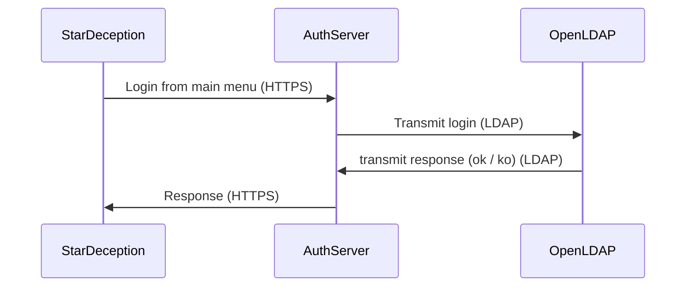

# Authentication

## Introduction

Here is the documentation for the authentication.

## Features

This is the features we need:

* *username* login
* *password*
* *email* (for reset / notifications)
* forgot password

## Technical servers

We need an authentication server by HTTPS.

It will be use by a backend with REST API.

The data must be stored in a database, perhaps basic like MariaDB / PostgreSQL, but perhaps use openLDAP because very good for that.

## Schema

